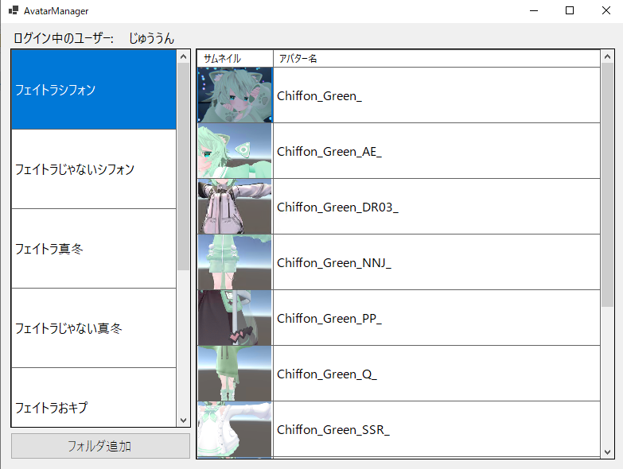

# AvatarManager

## 概要

[AvatarManager](https://ctw.booth.pm/items/6514840)はVRChatのアバターをフォルダに分けて切り替えを容易にするツールです。

[XSOverlay](https://store.steampowered.com/app/1173510/XSOverlay/?l=japanese)をはじめとするオーバーレイツールと組み合わせて使用することで、ゲーム中でも分かりやすくアバターを切り替えることを目標として制作されています。

