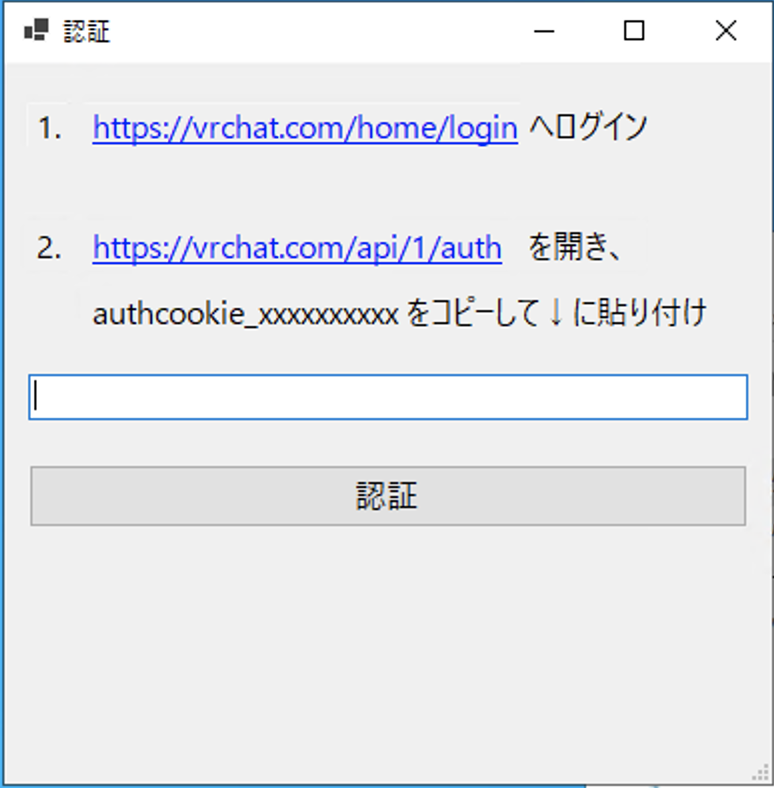
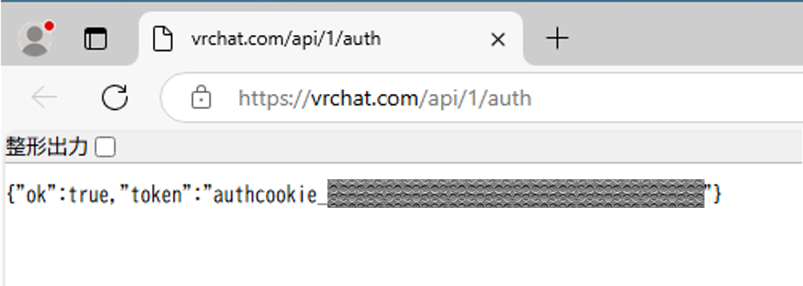

# ログイン

VRChatのAuthCookieを用いたログインを実装しています。

アプリケーションを起動すると上記ウィンドウが表示されるため、ウィンドウの指示に従い、以下の操作を行います。

1. [VRChatへログイン](https://vrchat.com/home/login)
    - 通常通りログインします
1. [AuthCookieの取得](https://vrchat.com/api/1/auth)
    - 以下のように表示されているものを `authcookie` から `"` までコピーしてウィンドウにペーストします
    